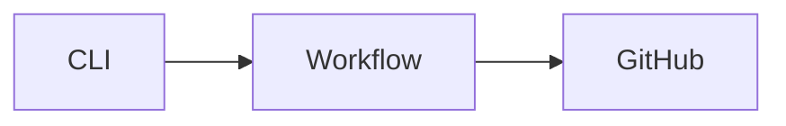

# Markdown

Every Pukbot body is GitHub-flavored Markdown. Comments, issue bodies, pull
request descriptions, and pull request review bodies are sent to GitHub byte
for byte, so any syntax GitHub renders in the web editor renders through
Pukbot without extra flags or escaping.

Agents should use real Markdown. Command help, logs, diffs, and structured
results belong in fenced code blocks, not in a wall of prose.

## What Pukbot does to a body

- Body text is passed through verbatim. Pukbot never reflows, wraps, trims, or
  re-escapes it.
- Named media placeholders are replaced before anything is sent. Each resolved
  media item is separated from adjacent content as its own Markdown paragraph.
- Comment bodies receive the disclosure footer, separated by a blank line, a
  thematic break, and another blank line, so the footer never joins the last
  block of the body.
- Issue bodies, pull request bodies, and review bodies receive no footer.
- Bodies are limited to 40,000 bytes, matching the GitHub limit.

## Supported syntax

### Headings

```markdown
# Heading one
## Heading two
###### Heading six
```

### Text styling

```markdown
**bold**, *italic*, ***bold italic***, ~~strikethrough~~, `inline code`
<sub>subscript</sub> and <sup>superscript</sup>
<kbd>ctrl</kbd> + <kbd>c</kbd>
```

### Line breaks

A single newline inside a paragraph becomes a line break. A blank line starts a
new paragraph. Two trailing spaces or a trailing backslash also force a break.

### Lists

```markdown
- unordered item
- another item
  - nested item

1. ordered item
2. second item

- [x] completed task
- [ ] open task
```

Task lists are interactive on issues and pull requests and roll up into the
pull request task counter.

### Code blocks

Fence multiline output and always name the language so GitHub highlights it and
so no character inside is interpreted as Markdown.

````markdown
```bash
pukbot capabilities --json
```

```rust
fn main() {
    println!("pukbot");
}
```

```text
OVERVIEW: List live sessions.
USAGE: ed herdr ls [--machine] [--json]
```
````

Use `diff` to show a change, and `console` or `text` for terminal transcripts
and command help. To show a fence inside a fence, wrap the outer block in four
backticks.

Unclosed fences are rejected before dispatch, because everything after them,
including the disclosure footer, would render as code.

### Tables

```markdown
| Check | Result | Notes |
| --- | :---: | ---: |
| `cargo fmt` | pass | |
| `cargo clippy` | fail | 3 warnings |
```

Use `:` in the delimiter row to set left, center, or right alignment. Escape a
literal pipe inside a cell as `\|`.

### Blockquotes and alerts

```markdown
> A plain quote.

> [!NOTE]
> Useful information the reader should notice.

> [!TIP]
> A helpful suggestion.

> [!IMPORTANT]
> Information required to complete the task.

> [!WARNING]
> A risk that needs immediate attention.

> [!CAUTION]
> A negative consequence of an action.
```

Each alert needs its own blockquote and cannot be nested inside another.

### Collapsed sections

Long logs belong behind a disclosure so the thread stays readable.

````markdown
<details>
<summary>Full test output</summary>

```text
running 2583 tests in 359 suites
test result: ok
```

</details>
````

Keep the blank line after `<summary>` and before `</details>`, otherwise the
Markdown inside is not rendered.

### Links, images, and media

```markdown
[Operations](https://github.com/pulkitxm/pukbot/blob/main/docs/Operations.md)
<https://gitbot.pulkit.page>

```

Prefer Pukbot media placeholders over hand written image Markdown when the file
is local. An attached video renders as a player rather than a link. See [Operations](Operations.md).

### References and mentions

```markdown
@octocat
#123
owner/repository#123
GH-123
a1b2c3d
owner/repository@a1b2c3d
```

Issue, pull request, commit, and user references autolink. A permalink to a
line range in a file renders as an embedded code snippet.

### Footnotes

```markdown
Pukbot dispatches a protected workflow.[^1]

[^1]: The CLI never receives the App private key.
```

### Diagrams and math

Mermaid, GeoJSON, TopoJSON, ASCII STL, and LaTeX math all render in GitHub
bodies.

````markdown


```math
E = mc^2
```
````

Inline math uses `$...$` and a block uses `$$...$$` or a `math` fence.

### Emoji

```markdown
:rocket: :warning: :white_check_mark:
```

### HTML

GitHub allows a sanitized subset of HTML, including `<details>`, `<summary>`,
`<sub>`, `<sup>`, `<kbd>`, ``, `<br>`, `<div>`, `<p>`, `<picture>`, and
tables. Scripts, styles, iframes, and event handlers are stripped.

### Comments and escaping

```markdown
<!-- this note is invisible in the rendered body -->
\*not italic\*
```

Backslash escaping works for every Markdown punctuation character.

## Passing Markdown safely

Multiline Markdown survives the CLI intact, but the shell and JSON both need
care.

Prefer a file or standard input for anything longer than one line:

```bash
pukbot comment create 123 --repo owner/repository --body-file comment.md
pukbot comment create 123 --repo owner/repository <comment.md
```

A quoted heredoc keeps backticks, `$`, and backslashes literal:

````bash
pukbot comment create 123 --repo owner/repository --body-file - <<'BODY'
### Result

```text
2583 tests in 359 suites
```
BODY
````

In JSON requests, newlines are `\n` and every embedded quote and backslash is
escaped. Generate the JSON with a serializer rather than by hand:

````json
{
  "operation": "comment_create",
  "repository": "owner/repository",
  "number": 123,
  "body": "### Result\n\n```text\n2583 tests in 359 suites\n```\n"
}
````

Validate before sending:

```bash
pukbot apply --input request.json --dry-run
```

`--dry-run` prints the exact body that would be posted, footer excluded, so the
rendering can be checked before anything reaches the thread.

## Rules for agents

- Put command output, help text, logs, diffs, JSON, and stack traces in a
  fenced code block with a language.
- Close every fence.
- Use a table for more than two parallel facts.
- Use a collapsed section for anything longer than roughly 30 lines.
- Use alerts for risk, not bold prose.
- Never paste raw multiline output as a paragraph.

## Discovery

The rendering contract is part of the machine readable inventory:

```bash
pukbot capabilities --json
```

The `markdown` object reports the flavor, that bodies are passed through
verbatim, the byte limit, which body kinds receive the footer, and the list of
supported syntax features.
